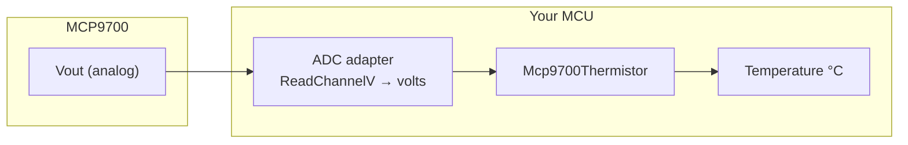

# HF-MCP9700 Driver

**Microchip [MCP9700](https://www.microchip.com/en-us/product/MCP9700) / [MCP9700A](https://www.microchip.com/en-us/product/MCP9700A) linear active thermistor — analog voltage to °C**

[](https://en.cppreference.com/w/cpp/17)
[](https://www.gnu.org/licenses/gpl-3.0)
[](https://github.com/N3b3x/hf-mcp9700-driver/actions/workflows/esp32-examples-build-ci.yml)
[](https://n3b3x.github.io/hf-mcp9700-driver/)

## Table of contents

1. [Live documentation](#live-documentation)
2. [Overview](#overview)
3. [Features](#features)
4. [Quick start](#quick-start)
5. [Repository layout](#repository-layout)
6. [Documentation map](#documentation-map)
7. [References](#references)
8. [ESP32 examples](#esp32-examples)
9. [License](#license)

## Live documentation

> **[Complete documentation site (GitHub Pages)](https://n3b3x.github.io/hf-mcp9700-driver/)** — guides, hardware diagrams, transfer function, API reference, and ESP32 walkthroughs.

On GitHub you can browse the same content under [`docs/`](docs/index.md).

## Overview

The MCP9700 family outputs an **analog voltage proportional to temperature**. This repository provides a **header-only** C++17 template, `hf::mcp9700::Mcp9700Thermistor<AdcType>`, that converts ADC readings in **volts** into **degrees Celsius** using the **typical** linear model from the Microchip datasheet:

`T_C ≈ (Vout − 0.5 V) / (10 mV/°C)` — override `v_zero_c` and `v_per_c` in the constructor when you calibrate or use alternate datasheet coefficients.

You implement a small **ADC adapter** with `EnsureInitialized()` and `ReadChannelV(uint8_t channel, float* voltage_v)` returning **0** on success (aligned with HardFOC-style `hf_adc_err_t` conventions).



## Features

- **Header-only** core — no static library required for the driver itself
- **Configurable** 0 °C offset and V/°C slope (defaults match MCP9700/MCP9700A typical values)
- **Version string** via CMake-generated `mcp9700_version.h` and `GetMcp9700DriverVersion()`
- **ESP-IDF ESP32-C6** example: `adc_oneshot`, optional **curve calibration**, default **ADC1 CH0 (GPIO0)**
- **CI** for ESP32 examples and **docs link checking** aligned with other HardFOC drivers

## Quick start

```cpp
#include "mcp9700_thermistor.hpp"

struct MyAdc {
  bool EnsureInitialized() noexcept { return true; }
  int ReadChannelV(uint8_t ch, float* v) noexcept {
    if (!v || ch != 0) return 1;
    *v = measured_voltage_volts;
    return 0;
  }
};

MyAdc adc;
hf::mcp9700::Mcp9700Thermistor<MyAdc> mcp(&adc, 0);
if (mcp.Initialize()) {
  float t{};
  if (mcp.ReadTemperatureCelsius(&t)) {
    // use t
  }
}
```

More detail: [Quick start](docs/quickstart.md) · [Installation](docs/installation.md) · [CMake integration](docs/cmake_integration.md).

## Repository layout

| Path | Purpose |
| --- | --- |
| [`inc/`](inc/) | Public headers (`mcp9700_thermistor.hpp`, generated `mcp9700_version.h`) |
| [`src/`](src/) | Template implementation (`mcp9700_thermistor.ipp`) |
| [`cmake/`](cmake/) | `hf_mcp9700_build_settings.cmake` for embedding in larger CMake trees |
| [`docs/`](docs/index.md) | Markdown guides, diagrams ([`docs/assets/`](docs/assets/)), Jekyll site input |
| [`examples/esp32/`](examples/esp32/) | ESP-IDF project (ESP32-C6); `scripts/` is a **git submodule** |
| [`_config/`](_config/) | Doxygen, Jekyll, format/lint, CI tooling |

## Documentation map

| Guide | Description |
| --- | --- |
| [Documentation home](docs/index.md) | Full table of contents and recommended reading order |
| [Installation](docs/installation.md) | Toolchain, includes, generated headers |
| [Quick start](docs/quickstart.md) | Minimal adapter + read path |
| [Transfer function](docs/transfer_function.md) | Equations, typical curve, calibration |
| [Hardware setup — ESP32-C6](docs/hardware_setup.md) | Wiring, ADC attenuation, pin map |
| [CMake integration](docs/cmake_integration.md) | `HF_MCP9700_*` variables and targets |
| [Examples](docs/examples.md) | ESP-IDF example overview |
| [API reference](docs/api_reference.md) | Class, adapter contract, constants |
| [Troubleshooting](docs/troubleshooting.md) | Common failures |
| [Datasheet & manufacturer links](docs/datasheet/README.md) | Official PDFs and product pages |

## References

| Resource | Link |
| --- | --- |
| Microchip MCP9700 product | <https://www.microchip.com/en-us/product/MCP9700> |
| Microchip MCP9700A product | <https://www.microchip.com/en-us/product/MCP9700A> |
| ESP-IDF ADC (ESP32-C6) | <https://docs.espressif.com/projects/esp-idf/en/stable/esp32c6/api-reference/peripherals/adc.html> |
| C++17 language reference | <https://en.cppreference.com/w/cpp/17> |

## ESP32 examples

Clone **with submodules** so `examples/esp32/scripts` (build/flash helpers) is present:

```bash
git clone --recursive https://github.com/N3b3x/hf-mcp9700-driver.git
# or, after a non-recursive clone:
git submodule update --init --recursive
```

Then:

```bash
cd examples/esp32
./scripts/build_app.sh list
./scripts/build_app.sh mcp9700_esp32c6_example Debug
./scripts/flash_app.sh mcp9700_esp32c6_example Debug
```

See [examples/esp32/README.md](examples/esp32/README.md) for `idf.py` usage, wiring, and logs.

## License

GPL-3.0 — see [LICENSE](LICENSE).
