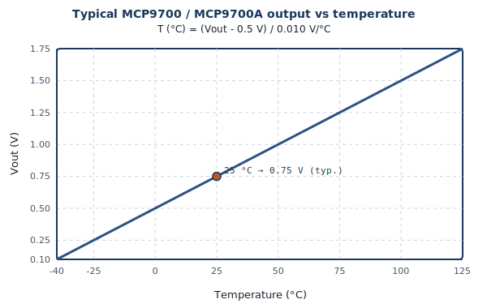
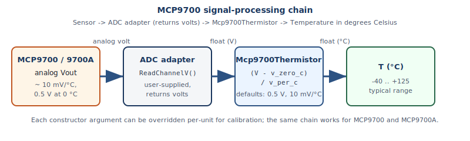

# Transfer function

The driver uses the **typical** linear relationship from the Microchip **[MCP9700 family datasheet](https://www.microchip.com/en-us/product/MCP9700)** (see also [MCP9700A](https://www.microchip.com/en-us/product/MCP9700A)):

`T_C = (Vout − v_zero_c) / v_per_c`

Default constructor arguments match the usual published typicals:

| Symbol | Default | Meaning |
| --- | --- | --- |
| `v_zero_c` | `0.5` V | Output at **0 °C** (typical) |
| `v_per_c` | `0.01` V/°C | **10 mV/°C** sensitivity (typical) |

Override both if you trim the sensor or use alternate coefficients from the **Electrical Characteristics** tables.

## Typical curve (illustration)

The following figure is a **schematic illustration** of the linear model over temperature; always use your ADC reading in **volts** at the pin after MCU scaling/attenuation.

## Numerical examples (typical model)

| T (°C) | Approx. Vout (V) |
| --- | --- |
| −40 | 0.10 |
| 0 | 0.50 |
| 25 | 0.75 |
| 85 | 1.35 |
| 125 | 1.75 |

Values assume **3.3 V** supply context as in many embedded designs; the sensor is ratiometric to its **Vdd** — see the datasheet for supply range and load conditions.

## Signal processing path

1. **ADC** must report **volts** at the MCP9700 output (after divider/attenuator if any).  
2. **Driver** subtracts `v_zero_c` and divides by `v_per_c`.  
3. **Calibration:** measure at known temperatures and adjust `v_zero_c` / `v_per_c`, or correct in your adapter.

## Related

- [API reference](api_reference.md) — constructor parameters  
- [Hardware setup](hardware_setup.md) — attenuation and voltage range  
- [Datasheet reference](datasheet/README.md) — official limits and accuracy  
